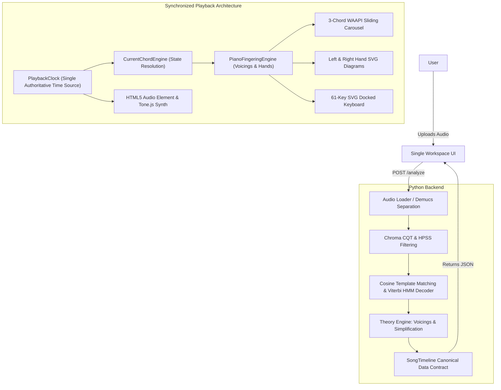

# HotChords: System Architecture (v0.3)

HotChords is an open-source, local piano chord detection and interactive learning workstation. It transforms raw audio into a playable music-learning blueprint, displaying what chords are playing, which piano keys to press, and which fingers to use.

---

## 1. Core Mission
To provide an intuitive, zero-latency, and visually elegant local chord-learning experience focused on pedagogical clarity and synchronized piano guidance.

---

## 2. Technical Stack
- **Backend:** Python 3.10+ (FastAPI, Uvicorn, Pydantic)
- **Signal Processing & ML:** Librosa (Chroma CQT, Beat Tracking, Key Detection), SciPy, NumPy, Demucs
- **Frontend Architecture:** Modern Vanilla JavaScript, CSS3, SVG
- **Animation:** Web Animations API (WAAPI) for 60fps GPU-accelerated physical sliding chord carousel and micro-interactions
- **Audio Playback:** HTML5 Audio + Tone.js Sampler (acoustic grand piano samples) + Web Audio API
- **Timing:** High-resolution monotonic `PlaybackClock`

---

## 3. System Architecture

### A. Backend DSP & Music Theory Pipeline
* **Audio Pipeline (`backend/analysis/pipeline.py`)**: Loads audio, applies Harmonic-Percussive Source Separation (HPSS) and optional Demucs stem separation to isolate harmonic components.
* **Feature Extraction**: Extracts Constant-Q Transform (CQT) chromagrams aligned to detected musical beat onsets.
* **Chord Classifier & Viterbi Smoothing**: Evaluates cosine similarity against harmonic chord templates (Major, Minor, 7ths, Suspended, Power chords) with Viterbi Hidden Markov Model temporal smoothing.
* **Theory Engine (`backend/theory/simplification.py`)**: Generates dual harmonic datasets:
  * `beginner_chords`: Musically sound harmonic reduction collapsing extensions into playable triads.
  * `original_chords`: Authentic, unreduced harmonic progression.

### B. Frontend Interactive Music Stand
* **Unified Single Workspace (`frontend/index.html`, `frontend/css/piano.css`)**: Permanent 4-tier layout (Header $\to$ Learning Area $\to$ 61-Key Piano $\to$ Playback Bar).
* **Deterministic 3-Chord Timeline (`frontend/js/ui/workspaceChordTimeline.js`)**: Fixed spatial column anchors (`PREVIOUS`, `CURRENT CHORD`, `NEXT`) with a 4-lane physical sliding carousel powered by WAAPI.
* **Hand Guidance Controller (`frontend/js/ui/workspaceHandController.js`)**: Real-time Left Hand (Bass foundation) and Right Hand (Harmony triad) SVG diagrams with downward finger press animations and color-coded note chips.
* **Persistent 61-Key Piano Keyboard (`frontend/js/ui/pianoKeyboard.js`)**: Mathematical SVG keyboard mapping MIDI keys (C2-C7) with color-coded key illumination strictly synchronized with hand fingerings.
* **Timing & Audio Controller (`frontend/js/audio/playbackClock.js`, `frontend/js/audio/songAudioController.js`)**: Single authoritative monotonic clock synchronizing song audio, synthesized piano tones, hand diagrams, and chord boundaries.

---

## 4. Pedagogical Color & Fingering System

A standardized 5-color pedagogical system used across hand diagrams, note chips, and piano keys:
* **Finger 1 (Thumb):** Red (`#FF4D4F`)
* **Finger 2 (Index):** Orange (`#FAAD14`)
* **Finger 3 (Middle):** Green (`#52C41A`)
* **Finger 4 (Ring):** Teal (`#13C2C2`)
* **Finger 5 (Pinky):** Blue (`#1677FF`)

---

## 5. Development Philosophy & Milestone Scope (v0.3)

Earlier development iterations explored multi-screen layouts, separate practice tabs, and lyric transcriptions. In Version 0.3, HotChords deliberately stripped away secondary complexity to focus on a **single permanent interactive music stand**. This ensures deterministic synchronization, clear state management, and an immersive learning interface.
