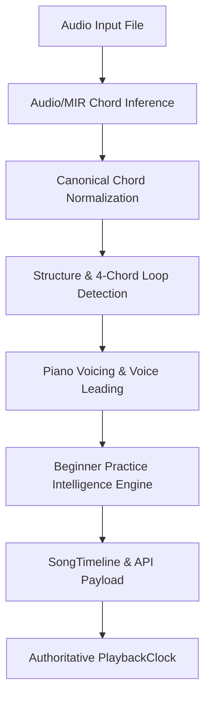

# HotChords Beginner Practice Intelligence Specification (Phase 9)

**Date**: September 2026  
**Auditor**: Senior Audio & MIR Architecture Team  
**Module**: `backend/theory/beginner_practice.py` & `backend/theory/transposition.py`  
**Purpose**: Deterministic pedagogical practice guidance, difficulty categorization, tempo recommendations, multi-level simplification, and intelligent key transposition.

---

## 1. Architectural Overview & Separation of Concerns

### Decoupled System Layers:
1. **Audio / MIR**: Decides *WHAT THE CHORD IS* (acoustics, chroma, pitch classes).
2. **Music Theory**: Decides *WHAT THE CHORD MEANS* (roots, qualities, diatonic functions).
3. **Piano Voicing**: Decides *HOW THE BEGINNER PLAYS IT* (voice-led MIDI keys, fingering, register).
4. **Practice Intelligence**: Decides *HOW THE BEGINNER LEARNS IT* (learning order, practice loop, starting tempo, key recommendations).
5. **PlaybackClock**: Decides *WHEN IT PLAYS* (continuous master playback synchronization).

---

## 2. Chord Difficulty Model

Each detected chord receives a deterministic difficulty score ($[0.0, 1.0]$) and category:

| Difficulty Category | Score Range | Criteria & Musical Description | Examples |
|---|---|---|---|
| **`EASY`** | $0.00 - 0.25$ | Natural white-key triads; natural hand posture; zero black keys. | `C`, `G`, `F`, `Am`, `Em`, `Dm` |
| **`MODERATE`** | $0.26 - 0.55$ | Single black key, dominant 7ths, or standard suspensions. | `D`, `A`, `E`, `Bm`, `Bb`, `G7`, `Gsus4` |
| **`DIFFICULT`** | $0.56 - 0.75$ | Multi-black key minor triads, 4-note 7ths, or inverted slash chords. | `C#m7`, `Abm`, `F#m7`, `C/E`, `D/F#` |
| **`VERY_DIFFICULT`** | $0.76 - 1.00$ | Diminished, augmented, altered half-diminished, or wide dissonant clusters. | `Bdim`, `Caug`, `Am7b5`, `C#dim7` |

### Evaluation Formula:
$$\text{Score} = 0.35 \times \text{BlackKeyRatio} + 0.30 \times \text{QualityWeight} + 0.20 \times \text{SpanFactor} + 0.15 \times \text{TransitionDistance}$$

---

## 3. Beginner Simplification Levels

HotChords provides 4 non-destructive simplification tiers:

- **Level 0 (Original)**: Full detected harmony with all extensions and polychords intact (`C:maj7`, `D:min9/F#`).
- **Level 1 (Extension Removal)**: Strips non-essential 7ths/9ths while retaining slash bass inversions (`Cmaj7 → C`, `Am7 → Am`, `Dmin9/F# → Dm/F#`).
- **Level 2 (Basic Triads)**: Reduces all chords to root-position triads (`Dm/F# → Dm`, `C/E → C`).
- **Level 3 (Modal Beginner Anchors)**: Maps rare altered accidentals to adjacent diatonic white-key anchors while strictly preserving root modality.

> [!IMPORTANT]
> **Strict Simplification Rules**:
> 1. Never turn a minor chord into a major chord (`Am` must never become `A`).
> 2. Never destroy raw detected chord labels.
> 3. Never fabricate fictitious chord substitutions.

---

## 4. Beginner Tempo Recommendation Formula

The recommended starting practice tempo is dynamically scaled based on average progression difficulty:

$$\text{BPM}_{\text{rec}} = \text{BPM}_{\text{original}} \times \text{ReductionFactor}$$

| Average Song Difficulty | Reduction Factor | Starting Practice Tempo (% BPM) | Minimum Bounded Tempo |
|---|---|---|---|
| **Easy ($\le 0.25$)** | $0.85$ | $85\%$ of Original BPM | $\ge 50\text{ BPM}$ |
| **Moderate ($0.26 - 0.50$)** | $0.70$ | $70\%$ of Original BPM | $\ge 45\text{ BPM}$ |
| **Difficult ($0.51 - 0.75$)** | $0.55$ | $55\%$ of Original BPM | $\ge 40\text{ BPM}$ |
| **Very Difficult ($> 0.75$)** | $0.45$ | $45\%$ of Original BPM | $\ge 35\text{ BPM}$ |

---

## 5. Practice Loop Selection Algorithm

Target practice loops are selected deterministically using harmonic priority:
1. **Priority 1**: Reliable 4-chord loop from `FourChordLoopResult` (`available == true`).
2. **Priority 2**: Structurally repeating section from `StructureAnalysisResult` (Verse/Chorus recurrence).
3. **Priority 3**: Safe introductory progression fallback (first 4 distinct chords).
4. **Safety Rejection**: On silent, non-harmonic, or monophonic rap audio, `available = false`.

---

## 6. Chord Learning Order & Hard Chord Analysis

Chords are organized into a step-by-step beginner learning curriculum:
1. **Most Frequent Easy Chords** (e.g. $C$, $G$, $Am$).
2. **Most Frequent Moderate Chords** (e.g. $D$, $Em$, $F$).
3. **Difficult Chords** (e.g. $C\#m7$, $Abm$).
4. **Rare/Transitional Chords**.

Each difficult chord provides transparent diagnostic explanation (e.g., *"Minor chord with multiple black keys and 4-note voicing"*) and safe simplified equivalents.

---

## 7. Global Key Transposition & Recommendation

The transposition engine (`backend/theory/transposition.py`) evaluates all 12 chromatic semitone offsets ($\Delta \in [-6, +5]$) and ranks candidate keys by:
- Reduction in average chord difficulty.
- Reduction in black-key usage.
- Increase in white-key anchor presence ($C, G, F, Am, Em, Dm$).
- Minimum transpose distance from original key.
