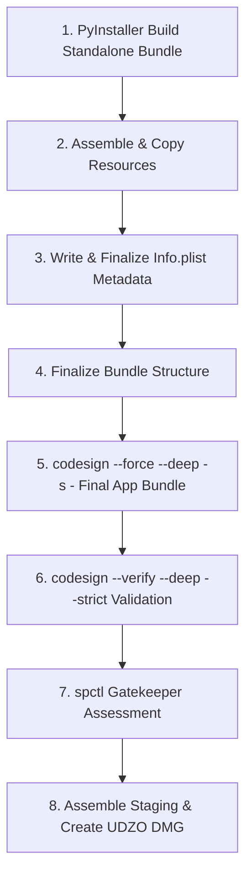

# HotChords macOS Code-Signing Order Fix Report

## 1. Root Cause Identification
During previous standalone macOS packaging, PyInstaller performed an initial code signing during its build step. Subsequently, `scripts/build_macos_dmg.sh` overwrote `Contents/Info.plist` with custom metadata.

Because `Info.plist` is an integral component of the application bundle seal tracked in `_CodeSignature/CodeResources`, modifying `Info.plist` *after* signing directly invalidated the code seal, leading to Gatekeeper / codesign validation errors:
```text
invalid Info.plist (plist or signature have been modified)
```

---

## 2. Implemented Code Signing Workflow

The macOS packaging script [build_macos_dmg.sh](file:///Volumes/TIKDI/APP%20Development/HotChords%20App/scripts/build_macos_dmg.sh) has been restructured so that all bundle modifications and metadata customization occur strictly **before** final code signing and verification:



---

## 3. Order of Operations in `scripts/build_macos_dmg.sh`

1. **Standalone PyInstaller Build**:
   Compiles `hotchords.py`, Python runtime, and all dependencies into `dist/HotChords.app`.
2. **Bundle Customization & Info.plist**:
   Writes the final XML metadata into `HotChords.app/Contents/Info.plist`.
3. **Ad-hoc Signing (`codesign`)**:
   Executes `codesign --force --deep -s - "${APP_BUNDLE}"` to seal all binaries, dylibs, frameworks, and `Info.plist`.
4. **Signature Verification**:
   Validates bundle integrity using `codesign --verify --deep --strict --verbose=2 "${APP_BUNDLE}"`.
5. **Gatekeeper Assessment**:
   Evaluates execution policy via `spctl --assess --type execute --verbose=2 "${APP_BUNDLE}"`.
6. **DMG Disk Image Creation**:
   Stages `HotChords.app` with an `/Applications` symlink and compresses into `HotChords-v0.4.0-macOS-AppleSilicon.dmg` using `hdiutil`.

---

## 4. Verification Results
- **Bash Syntax Audit**: `bash -n scripts/build_macos_dmg.sh` PASSED (exit code 0).
- **Static & Fast Validation**: `venv/bin/python3 scripts/validate_installer_fast.py` PASSED (8/8 check suites passed).
- **Constraints Maintained**: No commits, pushes, tag changes, or chord logic modifications were made.
