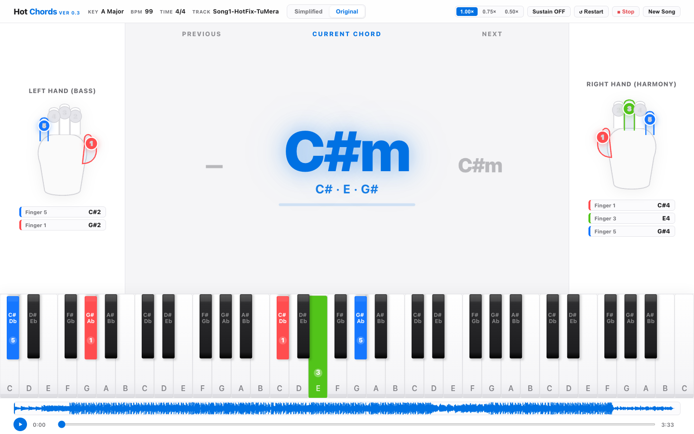
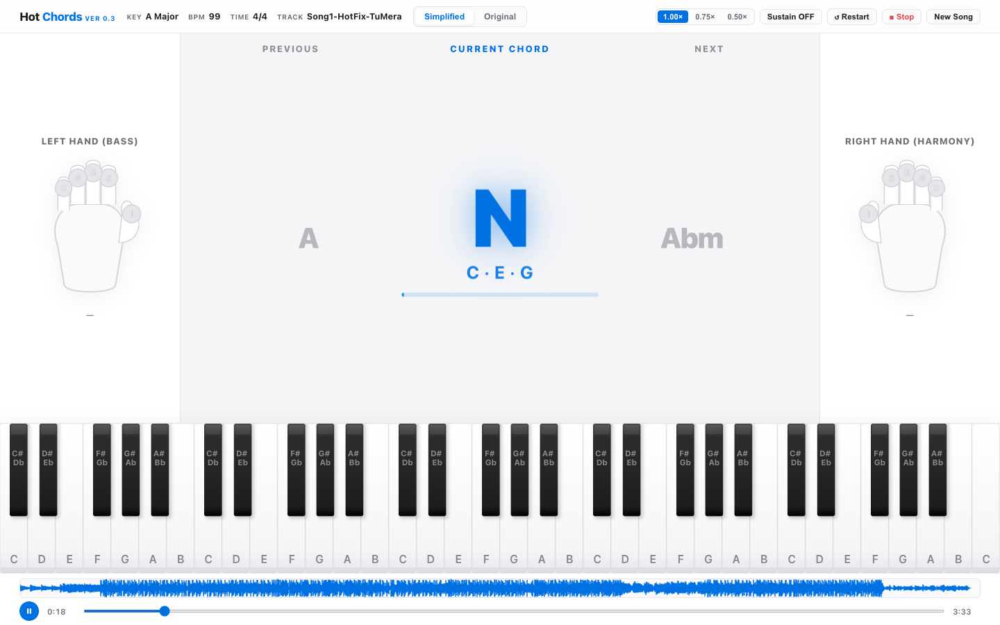
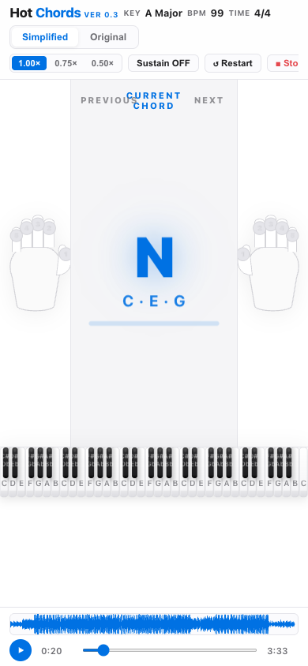
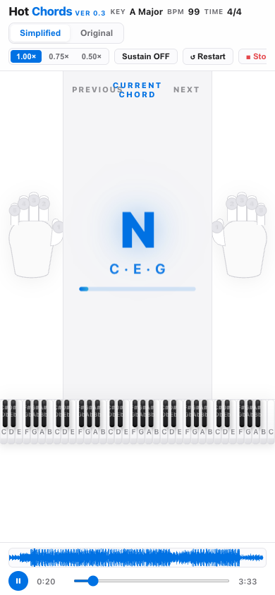

# HotChords

> **"Turn any song into chords you can play."**

[](CHANGELOG.md)
[](README.md)
[](tests/)

---

## Release Status: Version 0.3.0 (Development Milestone)

> [!IMPORTANT]
> - **Product Status**: Active Development
> - **UI/UX Status**: In Progress / Continuous Iteration
> - **Application Development**: **Not Complete**
> - **Milestone Scope**: Version 0.3 delivers a unified application shell, a transparent audio processing pipeline with honest milestone tracking, stationary timeline column anchors, enlarged interactive learning scale (prominent hands, massive hero chord, docked piano), and synchronized real-song playback.
> - **Accuracy & Reality**: Chord detection accuracy is under continuous real-song validation; it is not represented as 100% complete. Version 0.3 is an open development foundation, not a finished commercial product.

---

## What is HotChords?

HotChords is an open-source piano chord detection and interactive learning workstation. When a user uploads an audio track, HotChords answers the core music-learning questions in real time:

> **"What chord should I play right now, which piano keys do I press, and which fingers do I use?"**

---

## Visual Showcase (v0.3 Walkthrough)

### 1. Initial Upload Screen
The upload landing screen provides a structured, responsive entry point with supported format guidance (`MP3`, `WAV`, `M4A`, `FLAC`), drag-and-drop feedback, and keyboard accessibility.


---

### 2. Audio Processing & Real Pipeline Milestones
During audio analysis, HotChords maintains the persistent application shell, displays the uploaded song title, animates subtle waveform activity, and tracks real backend pipeline milestones (source separation, Chroma CQT, beat tracking, Viterbi HMM decoding, and voicing generation).


---

### 3. The Single Workspace (Interactive Music Stand)
Once analysis completes, the user transitions directly into a single, permanent interactive workspace. No tabs, no hidden sub-screens, and no detached windows.


---

### 4. Simplified vs Original Harmonic Modes
HotChords offers two distinct chord representations derived from the same audio:
* **Simplified Mode**: Harmonic reduction collapsing complex extensions, diminished harmonies, and rapid passing chords into beginner-playable triads and power chords.
* **Original Mode**: Unreduced harmonic progression capturing the song's authentic chord alterations.

| Simplified Mode | Original Mode |
| :---: | :---: |
|  |  |

---

### 5. Hero Current Chord & Fixed Spatial Labels
The central chord progression features stationary spatial column labels (`PREVIOUS`, `CURRENT CHORD`, `NEXT`) that remain fixed in place while the chords physically animate underneath using GPU-accelerated WAAPI transitions.

| Live Playback Hero Chord | Physical Chord Transition |
| :---: | :---: |
|  |  |

---

### 6. Synchronized Hand Guidance & Docked 61-Key Piano
Left Hand (Bass root + 5th foundation) and Right Hand (Harmony triad) illustrations feature reactive downward finger-press animations and color-coded note chips matching the docked 61-key piano keyboard.


---

### 7. Responsive Mobile Experience
The single-workspace music stand naturally reflows across tablet and mobile viewports (1440x900 down to 390x844) without clipping or horizontal overflow.

| Mobile Workspace | Mobile Live Playback |
| :---: | :---: |
|  |  |

---

## System Architecture


---

## Development Philosophy & Architectural Focus

Earlier development iterations concurrently explored multi-screen layouts, lyric transcriptions, separate practice views, and overlapping tab controllers. This created fragmented state management, visual clutter, and synchronization divergence.

For **Version 0.3**, HotChords was intentionally focused around a **single cohesive interactive music stand**:
1. **One Authoritative Clock**: `PlaybackClock` serves as the sole source of truth for audio playback, synthesized piano sounds, chord boundaries, hand diagrams, and piano key illumination.
2. **Deterministic UI**: Transitions, seeks, pauses, and restarts resolve instantaneously with zero orphaned transient animation nodes or drifting timers.
3. **Immersive Scale**: The interface uses the full viewport to present large, legible learning elements rather than sparse dashboards.
4. **Transparent Progress**: Processing stages expose real DSP pipeline progress instead of arbitrary spinners.

---

## Known Limitations & Active Research

* **Active UI/UX Development**: Visual balance and ergonomics are continuously being refined.
* **Chord Detection Accuracy**: The current pipeline uses CQT chroma template matching and Viterbi HMM smoothing. While effective on structured acoustic and pop songs, dense harmonic layers, heavy distortion, or polyphonic textures require ongoing validation and tuning.
* **Separation Latency**: Stems separation (Demucs) on longer tracks requires local CPU/GPU computation time.

---

## Quick Start

### Prerequisites
- **Python**: 3.10, 3.11, or 3.12
- **Node.js**: v18+ (for testing & browser QA suites)

### Setup & Launch

#### macOS / Linux
```bash
# 1. Clone repository
git clone https://github.com/itshotfix/HotChords.git
cd HotChords

# 2. Setup environment and install dependencies
bash scripts/setup_mac.sh

# 3. Launch HotChords
bash scripts/start_mac.sh
```

#### Windows
```cmd
:: 1. Clone repository
git clone https://github.com/itshotfix/HotChords.git
cd HotChords

:: 2. Setup environment
scripts\setup_windows.bat

:: 3. Launch HotChords
scripts\start_windows.bat
```

The application runs locally at `http://localhost:5500`.

---

## Verification & Testing

### Python Backend & Integration Suite (32 Scenarios)
```bash
./venv/bin/python -m pytest tests/ -v
```

### JavaScript Unit & Architecture Test Suites
```bash
npm test
```

### Automated Multi-Viewport Visual QA & Real Song Validation
```bash
node scripts/validate_workspace_scale_and_balance.js
node scripts/validate_workspace_real_songs.js
```

---

## Project Structure

```
HotChords/
├── hotchords.py                                    # Local application launcher
├── backend/                                        # Python DSP & Music Theory backend
│   ├── api/                                        # FastAPI endpoints (/analyze, /progress, /result)
│   ├── analysis/                                   # Audio decoding, CQT chroma, Viterbi HMM
│   ├── theory/                                     # Music theory normalization & simplification
│   ├── models/                                     # Pydantic data contracts (SongTimeline)
│   └── utils/                                      # Environment preflight & diagnostics
├── frontend/                                       # Single Workspace Web Application
│   ├── index.html                                  # Single workspace music stand shell
│   ├── css/piano.css                               # Design system, layout tokens, and animations
│   └── js/
│       ├── audio/                                  # PlaybackClock, Web Audio synth, audio controller
│       ├── engine/                                 # CurrentChordEngine, PianoFingeringEngine
│       └── ui/                                     # WorkspaceChordTimeline, WorkspaceHandController, PianoKeyboard
├── tests/                                          # Pytest and JavaScript test suites
├── scripts/                                        # Setup scripts, QA runners, and validation tools
├── test songs/                                     # Real-song validation audio files
└── docs/                                           # Architecture specs, changelog, and release screenshots
    └── screenshots/v0.3/                           # Official v0.3 high-resolution visual documentation
```

---

## License & Contributing
HotChords is open-source software licensed under the [MIT License](LICENSE).
Contributions are welcome! Please review [CONTRIBUTING.md](CONTRIBUTING.md) before submitting pull requests.
