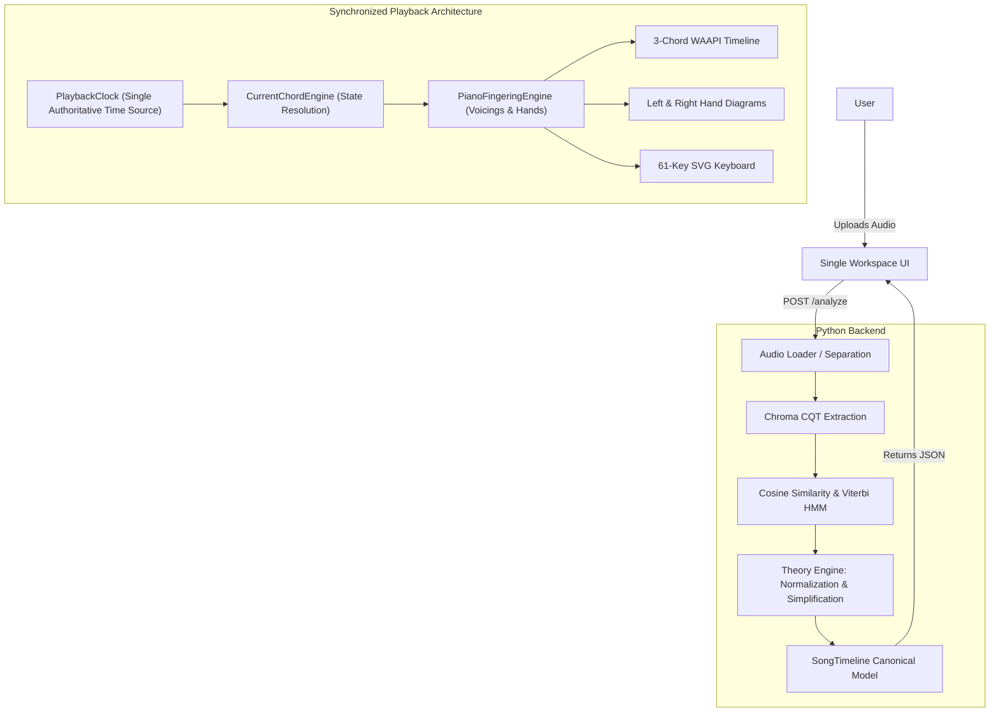

# HotChords

> **"Turn any song into something a beginner pianist can play."**

[](CHANGELOG.md)
[](README.md)
[](tests/)

---

## Release Status: Version 0.2.0 (Development Milestone)

> [!IMPORTANT]
> - **Product Status**: Active Development
> - **UI/UX Status**: In Progress / Continuous Iteration
> - **Application Development**: **Not Complete**
> - **Milestone Scope**: Version 0.2 is an intentional stabilization and core architecture milestone. During earlier development, multiple features and complex UI layouts were built concurrently. To ensure rock-solid stability and clear code boundaries, we intentionally simplified the application into a single, cohesive interactive music stand before expanding functionality further.

---

## What is HotChords?

HotChords is an open-source piano chord detection and interactive learning workstation. When a user uploads a song, HotChords immediately answers the core musical question:

> **"What chord should I play right now, which keys should I press, and which fingers should I use?"**

---

## Core Functionality (v0.2.0)

1. **Audio Loading & Analysis**:
   - Local audio processing for MP3, WAV, FLAC, M4A, OGG, AAC.
   - BPM, key detection, and harmonic separation.
2. **Dual-Mode Chord System**:
   - **Original Chords**: Detects and tracks harmonic progressions with overtone-aware template matching and Viterbi HMM smoothing.
   - **Simplified Chords**: Musically sound harmonic reduction collapsing complex extensions, suspended chords, and rapid passing chords into beginner-playable triads.
3. **Single Permanent Workspace (Interactive Music Stand)**:
   - Unified 4-tier vertical hierarchy: Header $\to$ Mode Selector & Controls $\to$ Central Learning Area $\to$ Persistent Piano $\to$ Transport & Waveform.
4. **Deterministic 3-Chord Timeline**:
   - **Previous < Current Hero > Next** physical sliding reel powered by GPU-accelerated WAAPI animations.
   - Hero Current Chord treatment (`scale(1.08)` + subtle glow + note breakdowns).
   - Instantaneous seek reset with zero animation lag.
5. **Interactive Hand Guidance**:
   - Left Hand (Bass root + 5th power foundation) and Right Hand (Triad/7th harmony).
   - Reactive finger-press downward micro-animations and color-coded note chips.
6. **Persistent 61-Key Piano Keyboard**:
   - Shared SVG keyboard with color-coded key illumination strictly matching Left and Right hand finger assignments.
7. **Synchronized Playback Engine**:
   - Single authoritative `PlaybackClock` orchestrating audio, Web Audio synth, chord progression, hands, and piano.
   - Play, Pause, Resume, Restart, Stop, Variable Speeds (0.50x, 0.75x, 1.00x), and Sustain Pedal control.

---

## System Architecture




---

## Quick Start

### Prerequisites
- **Python**: 3.10, 3.11, or 3.12
- **Node.js**: v18+ (for running validation test suites)

### Setup & Launch

#### macOS / Linux
```bash
# 1. Clone the repository
git clone https://github.com/itshotfix/HotChords.git
cd HotChords

# 2. Setup environment and install dependencies
bash scripts/setup_mac.sh

# 3. Launch HotChords
bash scripts/start_mac.sh
```

#### Windows
```cmd
:: 1. Clone repository
git clone https://github.com/itshotfix/HotChords.git
cd HotChords

:: 2. Setup environment
scripts\setup_windows.bat

:: 3. Launch HotChords
scripts\start_windows.bat
```

The application will start locally at `http://localhost:5500`.

---

## Running Tests

### Python Backend & Integration Test Suite (32 Tests)
```bash
./venv/bin/python -m pytest tests/ -v
```

### Real-Song Browser Validation (Puppeteer)
```bash
node scripts/validate_workspace_real_songs.js
```

---

## Project Structure

```
HotChords/
├── hotchords.py              # Local application launcher
├── backend/                  # Python DSP & Theory backend
│   ├── api/                  # FastAPI endpoints (/analyze, /timeline)
│   ├── analysis/             # Audio decoding, CQT chroma, Viterbi HMM
│   ├── theory/               # Music theory normalization & simplification
│   ├── models/               # Pydantic data contracts (SongTimeline)
│   └── utils/                # Environment preflight & diagnostics
├── frontend/                 # Static web application (Vanilla JS)
│   ├── index.html            # Single workspace music stand shell
│   ├── css/piano.css         # Design system & responsive layout
│   └── js/
│       ├── audio/            # PlaybackClock, Web Audio synth, audio controller
│       ├── engine/           # CurrentChordEngine, PianoFingeringEngine
│       └── ui/               # WorkspaceChordTimeline, WorkspaceHandController, PianoKeyboard
├── tests/                    # Pytest and JavaScript test suites
├── scripts/                  # OS setup scripts and validation runners
├── test songs/               # Real-song validation audio files
└── docs/                     # Architectural documentation & technical specs
```

---

## License & Contributing
HotChords is open-source software licensed under the [MIT License](LICENSE).
Contributions are welcome! Please review [CONTRIBUTING.md](CONTRIBUTING.md) before submitting pull requests.
