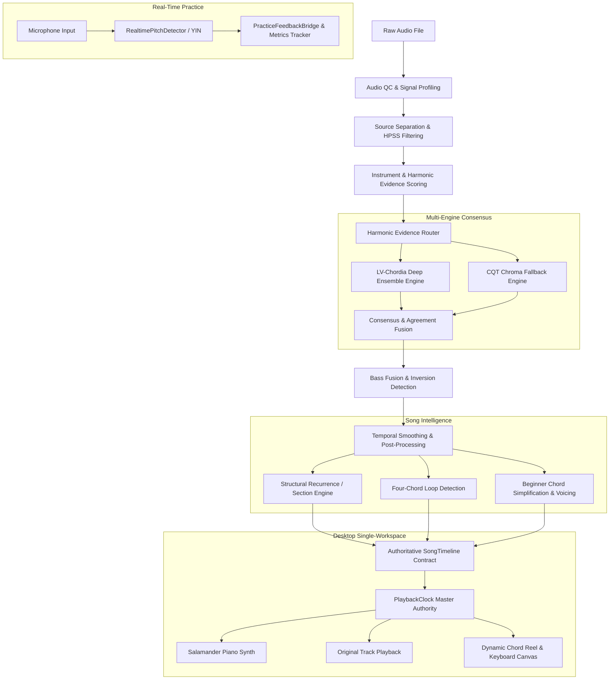

# HotChords

> **Turn any song into playable piano chords — locally, transparently, and without hiding the hard parts of audio analysis.**

[](https://github.com/itshotfix/HotChords/releases/tag/v0.4.0)
[](https://www.python.org/)
[](LICENSE)
[](tests/)
[](tests/)

---

## What is HotChords?

HotChords is an open-source, local-first interactive music workstation that takes raw audio files (`MP3`, `WAV`, `FLAC`, `M4A`) and transforms them into structured piano chord progressions with synchronized keyboard voicings, dynamic hand fingering diagrams, and real-time microphone practice feedback.

Unlike cloud-based chord tools that hide detection errors behind black boxes, HotChords is built on **harmonic transparency**: it exposes the detected musical source, source attribution confidence, mathematical agreement reasons, and an honest chord reliability score.

---

## Features

- 🎹 **Multi-Engine Chord Consensus:** Combines `lv-chordia` deep neural ensemble transcription with constant-Q transform (CQT) chroma template fallback and slash chord / bass fusion.
- 🔬 **Harmonic Source & Instrument Attribution:** Identifies which stem or instrument carries the primary harmony (e.g., *Harmonic Stem*, *Piano*, *Guitar*, or *Separated Mix*) while strictly excluding non-harmonic sources (drums, vocals).
- 📊 **Chord Confidence Breakdown:** Provides transparent mathematical confidence scores based on harmonic energy fit, temporal stability, and beat alignment — with zero synthetic accuracy claims.
- 🔁 **Four-Chord Loop Detection:** Automatically detects repeated 4-chord progression cycles (e.g. $F\sharp \rightarrow B\flat7 \rightarrow E\flat m \rightarrow B$) and sets zero-drift practice loops.
- 👶 **Adaptive Beginner Simplification:** Intelligently reduces complex or extended jazz chords to clean, root-position and standard triad fingerings without breaking the song structure.
- 🖐️ **Left & Right Hand Dynamic Voicings:** Computes voice-led piano voicings with biomechanical finger assignment ($1 \dots 5$) on an interactive 88-key piano keyboard.
- 🎧 **Dual-Source Synchronized Playback:** Switch seamlessly between a high-fidelity Salamander Grand Piano synthesizer and original track audio playback governed by the master `PlaybackClock`.
- 🎙️ **Microphone Practice Mode:** Evaluates live acoustic piano performance in real time using client-side YIN autocorrelation with pitch tolerance and practice metrics tracking.
- 🔒 **100% Local & Private:** All audio processing, demixing, and chord detection happen directly on your machine. No audio is ever uploaded to remote servers.

---

## System Architecture



For full technical specifications, see [docs/ARCHITECTURE.md](docs/ARCHITECTURE.md).

---

## Screenshots

### 1. Main Workstation & Harmonic Intelligence
Displays detected chords, authoritative key/tempo metadata, harmonic detection source (*Harmonic Stem* / *Guitar* / *Piano*), source confidence, and overall chord confidence.


---

### 2. Four-Chord Loop Practice Engine
Isolates recurring 4-chord cycles and binds seamless, zero-drift hardware loops for targeted practice sessions.


---

### 3. Dual-Source Audio Transport
Allows instant toggling between polyphonic Salamander Grand Piano synthesis and the original audio recording with hardware pitch preservation.


---

### 4. Real-Time Microphone Practice Mode
Listens to live acoustic piano playing via low-latency client-side autocorrelation and delivers instant visual note feedback.


---

## Installation & Setup

### Prerequisites
- **Python 3.10+** (Python 3.11, 3.12, 3.13, 3.14 supported)
- **Node.js 18+** (for running client test suites)
- **FFmpeg** (required by Librosa/SoundFile for decoding diverse audio codecs)

### 1. Clone the Repository
```bash
git clone https://github.com/itshotfix/HotChords.git
cd HotChords
```

### 2. Python Environment & Dependencies
```bash
# Create and activate virtual environment
python3 -m venv venv
source venv/bin/activate   # On Windows: venv\Scripts\activate

# Install dependencies
pip install -r requirements.txt
```

### 3. Frontend Dependencies (Optional / Test Development)
```bash
npm install
```

---

## Running Locally

To launch HotChords locally:

```bash
# Option A: Universal Launcher
python hotchords.py

# Option B: Direct Backend Server
python backend/main.py
```

The application will start the local FastAPI server and automatically open your default browser at:
👉 **`http://127.0.0.1:5501/`**

---

## Usage Guide

1. **Upload Audio:** Drag and drop an audio file (`.mp3`, `.wav`, `.m4a`, `.flac`) into the upload dropzone.
2. **Review Analysis:** Inspect the detected key, BPM, harmonic source attribution, and chord confidence.
3. **Practice with 4-Chord Loop:** If a recurring progression is detected, click the **4-Chord Loop** button to loop the main progression continuously.
4. **Switch Playback Source:** Toggle between **Piano Audio** (synthesized piano arrangement) and **Original Track** (uploaded master track).
5. **Enable Microphone Practice:** Click **Practice: OFF** to toggle on real-time acoustic pitch recognition and play along on your physical piano or keyboard.

---

## Testing

HotChords is backed by rigorous automated test suites across both backend Python algorithms and frontend client components.

```bash
# Run the complete Python test suite (195 tests)
pytest tests/

# Run the complete Frontend / Node test suite (55 tests)
npm test

# Run the Playback Lifecycle & Dual-Source Renderer test suite
node tests/test_playback_lifecycle.js

# Run Real-Time Client Pitch & Practice Feedback tests
node tests/test_phase11_client_pitch_and_feedback.js
node tests/test_phase12_client_metrics.js
```

---

## Chord Confidence vs. Real-World Accuracy

> [!IMPORTANT]
> **Understanding Confidence Metrics in HotChords**
>
> "Chord Confidence" in HotChords is a **model and harmonic signal confidence score** computed from spectral energy distribution, temporal consistency, and beat boundary stability.
>
> It is **not** an empirical claim of ground-truth accuracy on commercial mixes unless verified against isolated multi-track stems or physical acoustic sensor ground truth. Real-world acoustic recordings with heavy vocal vibrato, dynamic filtering, or non-diatonic jazz extensions can present ambiguous harmonic evidence.

---

## Known Limitations

- **Complex Jazz Voicings:** Dense poly-chords (e.g. $C13\sharp11$) may be simplified to their dominant base or root triad in simplified mode.
- **Extreme Reverb / Heavy Distortion:** Highly saturated or distorted guitar tracks with elevated noise floors may reduce separation clarity.
- **Acoustic Microphone Latency:** Browser Web Audio input latency varies by operating system audio driver; calibration is recommended for high-tempo tracking.

---

## Privacy Policy

HotChords runs **entirely offline on your local device**:
- No uploaded audio files are transmitted to external APIs or cloud providers.
- No analytics, tracking beacons, or telemetry data are collected.
- All temporary demixed stems are stored strictly in your local system temporary directory and deleted upon app reset.

---

## Contributing

We welcome contributions from developers, musicians, and MIR researchers! Please review [CONTRIBUTING.md](CONTRIBUTING.md) and [CODE_OF_CONDUCT.md](CODE_OF_CONDUCT.md) before submitting pull requests.

---

## License

HotChords is released under the [MIT License](LICENSE).
Bundled piano samples are derived from the [Salamander Grand Piano](frontend/audio/samples/LICENSE.txt) (Creative Commons Attribution 3.0).
For complete third-party dependency licenses, see [THIRD_PARTY_LICENSE_AUDIT.md](THIRD_PARTY_LICENSE_AUDIT.md).
