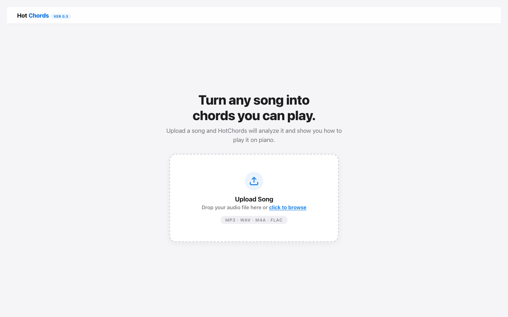
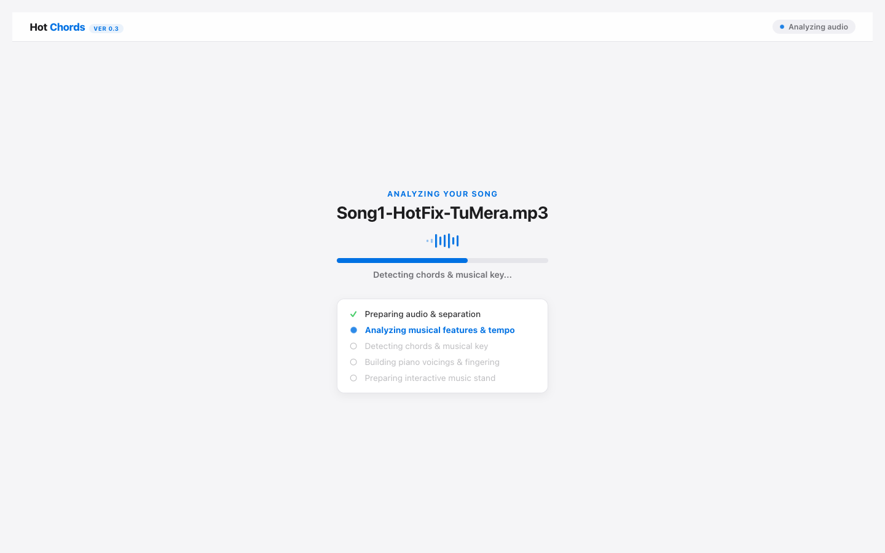
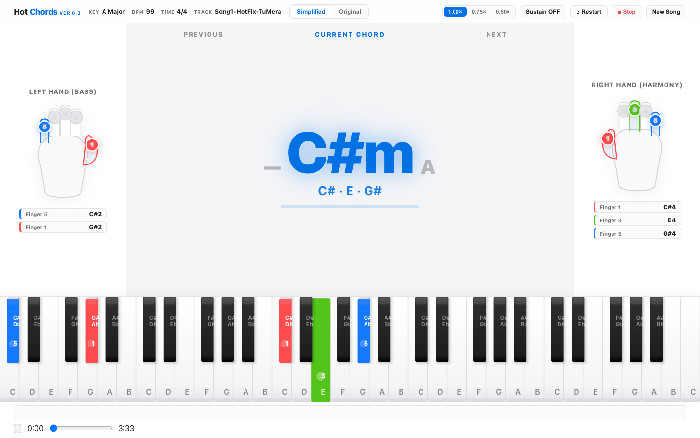
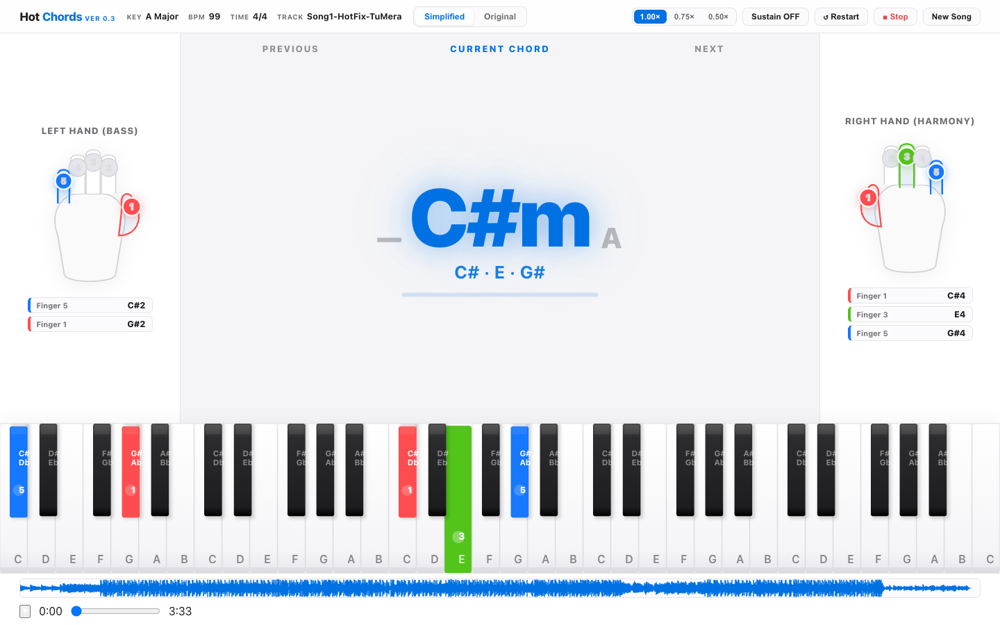
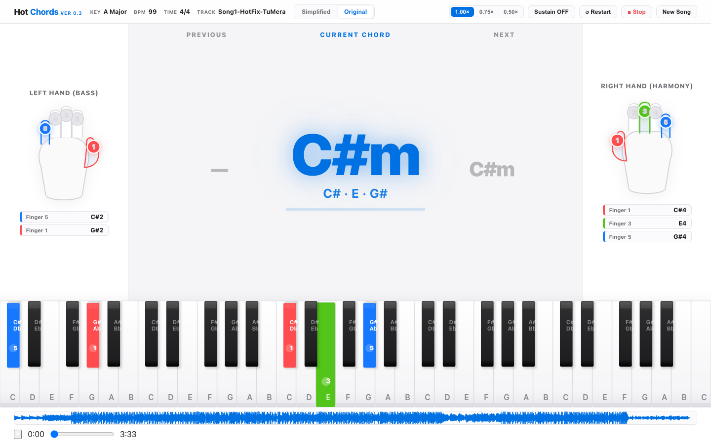
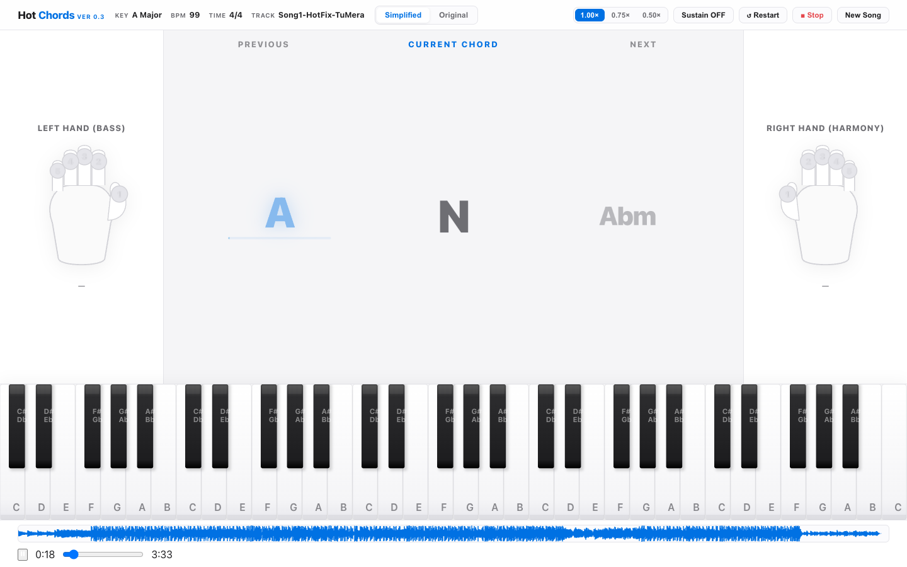
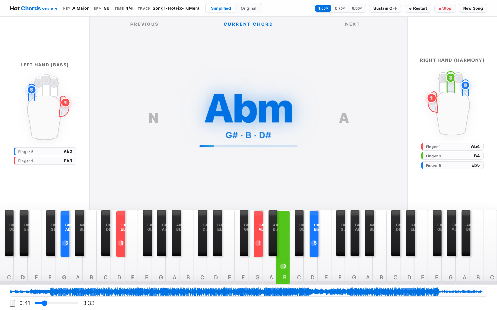
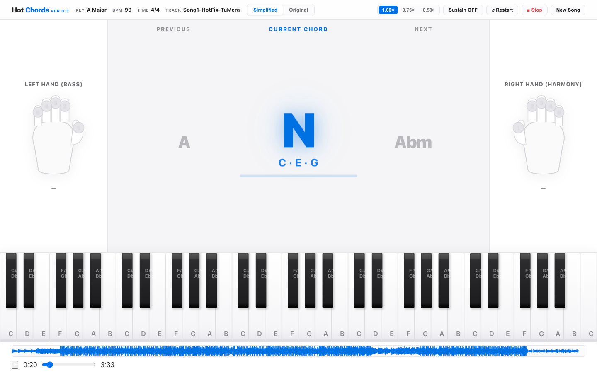
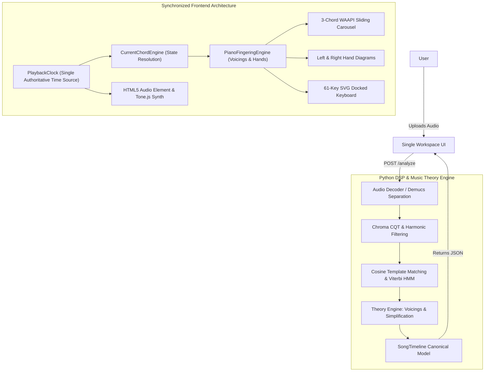

# HotChords

> **Turn any song into chords you can play.**

[](https://github.com/itshotfix/HotChords/releases/tag/v0.3.0)
[](#project-status)
[](LICENSE)
[](tests/)

---

## Install HotChords (Desktop)

HotChords is **free, open-source, and runs 100% locally on your computer**. No manual installation of Python, Node.js, virtual environments, or AI dependencies is required for general users.

### Direct Installer Downloads

| Operating System | Installer File | Format | Download Link |
| :--- | :--- | :---: | :---: |
| **Windows** (64-bit) | `HotChords-v0.3.0-Windows-x64-Setup.exe` | `.exe` | [**Direct Download (.exe)**](https://github.com/itshotfix/HotChords/releases/download/v0.3.0/HotChords-v0.3.0-Windows-x64-Setup.exe) |
| **macOS** (Apple Silicon — M1/M2/M3/M4) | `HotChords-v0.3.0-macOS-AppleSilicon.dmg` | `.dmg` | [**Direct Download (.dmg)**](https://github.com/itshotfix/HotChords/releases/download/v0.3.0/HotChords-v0.3.0-macOS-AppleSilicon.dmg) |
| **macOS** (Intel x86_64) | `HotChords-v0.3.0-macOS-Intel.dmg` | `.dmg` | [**Direct Download (.dmg)**](https://github.com/itshotfix/HotChords/releases/download/v0.3.0/HotChords-v0.3.0-macOS-Intel.dmg) |

### Quick Start
1. **Download the installer** for your operating system from the table above.
2. **Run the installer / open disk image** and drag HotChords to Applications (or follow Windows Setup wizard).
3. **Launch HotChords**. It will start the local engine and open automatically in your browser at `http://hotchords.localhost:5500` (or `http://localhost:5500`).

---

## What HotChords Does

HotChords turns an uploaded song into an interactive desktop piano chord-learning workstation. It provides clear, real-time answers to the core questions:

> **"What chord should I play right now, which keys do I press, and which fingers should I use?"**

```
Song Upload
    ↓
Audio Analysis & Separation
    ↓
Harmonic Chord Detection
    ↓
Simplified / Original Mode Toggle
    ↓
Previous / Current / Next Chord Timeline
    ↓
Left Hand (Bass) + Right Hand (Harmony) Fingering
    ↓
Docked 61-Key Piano Visualization
    ↓
Synchronized Playback & Transport Controls
```

---

## Screenshots (v0.3)

### 1. Upload Landing Screen
Drag and drop any audio file (`MP3`, `WAV`, `M4A`, `FLAC`) or browse to begin.



---

### 2. Audio Processing & Real Pipeline Milestones
Transparently tracks actual DSP stages (demixing, Chroma CQT extraction, beat tracking, Viterbi HMM decoding, and fingering generation) with live progress.



---

### 3. The Single Workspace (Interactive Music Stand)
A permanent, single-screen workspace designed as an immersive desktop music stand.



---

### 4. Simplified vs. Original Harmonic Modes
Switch dynamically between reduced beginner triads and authentic original chord progressions without losing playback position.

| Simplified Mode | Original Mode |
| :---: | :---: |
|  |  |

---

### 5. Hero Current Chord & Stationary Timeline Labels
Fixed spatial column labels (`PREVIOUS`, `CURRENT CHORD`, `NEXT`) remain stationary while chords physically glide beneath them in real time.

| Current Chord Hero | Coordinated Chord Transition |
| :---: | :---: |
|  |  |

---

### 6. Hand & Piano Guidance
Synchronized Left Hand (bass foundation) and Right Hand (harmony triad) illustrations with downward finger press animations and color-coded note chips matching the 61-key piano keyboard.



---


## How It Works



---

## Core Features

* **Single Permanent Workspace**: Consolidated interactive music stand eliminating multi-screen tab switching.
* **Dual Chord Modes**:
  * **Simplified Mode**: Musically sound harmonic reduction collapsing complex extensions, diminished harmonies, and rapid passing chords into beginner-playable triads.
  * **Original Mode**: Unreduced harmonic progression capturing authentic chord alterations.
* **Stationary Timeline Column Anchors**: `PREVIOUS`, `CURRENT CHORD`, and `NEXT` labels remain spatially fixed while chord cards slide physically via GPU-accelerated WAAPI transitions.
* **Interactive Hand Guidance**: Left Hand (Bass root + 5th power foundation) and Right Hand (Triad harmony) with color-coded finger chips (1=Thumb..5=Pinky).
* **Docked 61-Key Piano**: Key illumination synchronized strictly with Left/Right hand finger assignments.
* **Synchronized Transport Controls**: Play, Pause, Resume, Restart, Stop, Variable Speeds (`0.50x`, `0.75x`, `1.00x`), and Sustain Pedal toggling.

---

## Offline Use

HotChords operates **100% offline and locally**. All audio processing, harmonic analysis, chord detection, and synthesized tone playback are executed on your local machine. No audio is ever uploaded to external cloud servers.

---

## Accuracy & Limitations

* **Chord Detection Research**: Chord detection is currently under continuous real-song validation. The project maintains automated and real-song regression testing suites, but an independently annotated ground-truth dataset has not yet been established for an overall accuracy percentage. Accuracy is not represented as 100% or commercially complete.
* **Acoustic / Dense Audio**: Detection performs reliably on structured acoustic, pop, and vocal tracks. Highly distorted mixes, dense orchestral polyphony, or heavily detuned instruments remain active areas of ongoing research.
* **Source Separation**: Local stem separation relies on Demucs and available CPU/GPU resources.

---

## Project Status

* **Current Release**: Version 0.3 (`v0.3.0`)
* **Development Status**: **Active Open-Source Development**
* **UI/UX Status**: Continuous Iteration & Refinement
* **Application Scope**: Version 0.3 is a stable development milestone establishing the unified single workspace, scale corrections, and synchronization foundation. Additional features are intentionally deferred to future milestones.

---

## Development (For Contributors Only)

> [!NOTE]
> This section is for developers contributing to the HotChords codebase. End users should follow the [Install HotChords](#install-hotchords) section above.

### Prerequisites
* **Python**: 3.10, 3.11, or 3.12
* **Node.js**: v18+ (for automated browser QA and unit testing)

### Setup & Local Execution

#### macOS / Linux
```bash
# Clone the repository
git clone https://github.com/itshotfix/HotChords.git
cd HotChords

# Run setup script
bash scripts/setup_mac.sh

# Start development server
bash scripts/start_mac.sh
```

#### Windows
```cmd
:: Clone the repository
git clone https://github.com/itshotfix/HotChords.git
cd HotChords

:: Run setup script
scripts\setup_windows.bat

:: Start development server
scripts\start_windows.bat
```

### Running Automated Test Suites

```bash
# Python backend & integration suite (32 tests)
./venv/bin/python -m pytest tests/ -v

# JavaScript architecture & playback suites (37 tests)
npm test

# 4-Song real-audio regression test (100 scenarios)
node scripts/validate_workspace_real_songs.js

# Multi-viewport scale and spatial balance QA
node scripts/validate_workspace_scale_and_balance.js
```

---

## Contributing

Contributions are welcome! Please read [CONTRIBUTING.md](CONTRIBUTING.md) and [docs/ARCHITECTURE.md](docs/ARCHITECTURE.md) before submitting pull requests.

---

## License

HotChords is free and open-source software licensed under the [MIT License](LICENSE).
