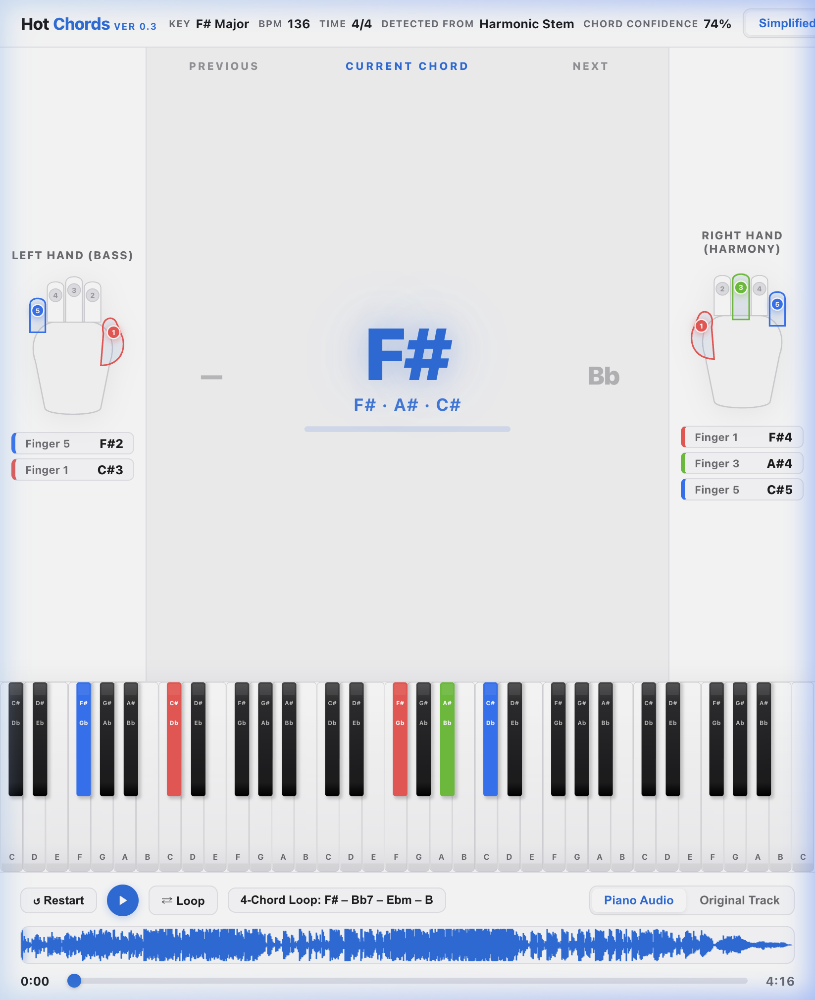
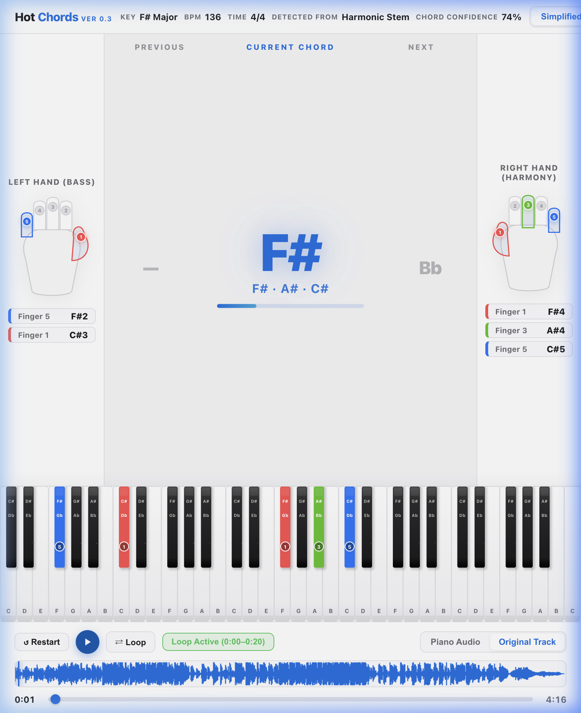
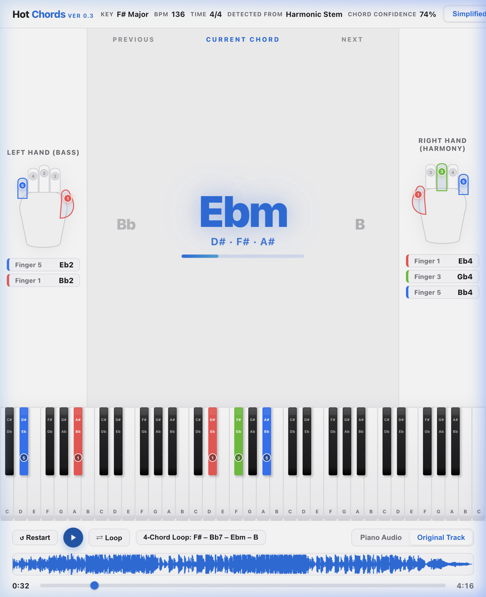
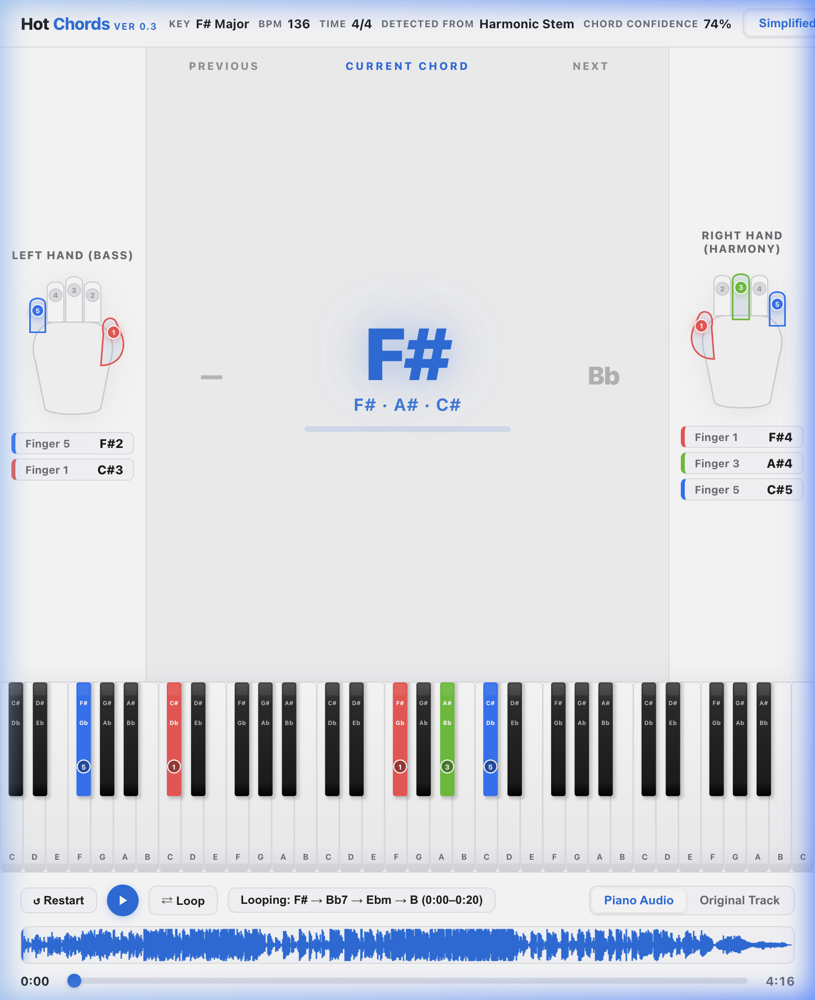

# HotChords

Turn songs into playable piano chords with local audio analysis.

## Download

### Windows

[Download HotChords v0.4.0 for Windows](https://github.com/itshotfix/HotChords/releases/download/v0.4.0/HotChords-v0.4.0-Windows-x64-Setup.exe)

Windows 10 and Windows 11, x64.

Installation:

1. Download the installer.
2. Double-click the installer.
3. Complete installation.
4. HotChords will launch automatically in your browser.

### macOS

[Download HotChords v0.4.0 for macOS](https://github.com/itshotfix/HotChords/releases/download/v0.4.0/HotChords-v0.4.0-macOS-AppleSilicon.dmg)

Apple Silicon.

Installation:

1. Download the DMG.
2. Open it.
3. Drag HotChords to Applications.
4. Launch HotChords.

No Python, Git, Node.js, or terminal setup is required for the packaged applications.

## What it does

HotChords analyzes an audio file and turns its harmonic content into playable piano chords.

- Detects chord progressions from songs
- Identifies the primary harmonic source
- Provides chord confidence information
- Finds recurring four-chord sections
- Generates beginner-friendly piano voicings
- Supports original-track and piano playback

## Preview

### Workstation


### Four-Chord Loop


### Playback


### Practice Mode


## Current Release

Version: 0.4.0

### Windows Installer
- Filename: HotChords-v0.4.0-Windows-x64-Setup.exe
- Platform: Windows 10 & 11 (x64)
- Direct Download: [HotChords v0.4.0 for Windows](https://github.com/itshotfix/HotChords/releases/download/v0.4.0/HotChords-v0.4.0-Windows-x64-Setup.exe)

### macOS Installer
- Filename: HotChords-v0.4.0-macOS-AppleSilicon.dmg
- Platform: macOS Apple Silicon
- Direct Download: [HotChords v0.4.0 for macOS](https://github.com/itshotfix/HotChords/releases/download/v0.4.0/HotChords-v0.4.0-macOS-AppleSilicon.dmg)
- SHA-256: `49d8008569c1b88b027149eeb4c5a4fc8804f650a55a2cf4adf338d6d843404f`

Full release:

https://github.com/itshotfix/HotChords/releases/tag/v0.4.0

## For Developers

The source repository is provided for development and contribution.

### Requirements

- Python 3.10+
- Node.js 18+
- FFmpeg

### Setup

```bash
# Clone the repository
git clone https://github.com/itshotfix/HotChords.git
cd HotChords

# Set up Python virtual environment
python3 -m venv venv
source venv/bin/activate
pip install -r requirements.txt

# Install frontend dependencies (for testing)
npm install

# Launch locally
python hotchords.py
```

### Tests

```bash
# Python backend tests
pytest tests/

# Frontend test suite
npm test
```

## Documentation

- [Architecture](docs/ARCHITECTURE.md)
- [Contributing](CONTRIBUTING.md)
- [Security](SECURITY.md)
- [Changelog](CHANGELOG.md)

## Accuracy and Confidence

Chord Confidence is a signal and model confidence measure. It is not a verified real-world accuracy percentage. Acoustic piano ground-truth accuracy has not yet been established.

## Privacy

HotChords processes audio locally on the user's machine. Audio is not uploaded to a cloud service.

## Known Limitations

- Complex jazz voicings and extended poly-chords may be simplified to their dominant base or root triad.
- Heavily saturated or distorted audio tracks with high noise levels may reduce harmonic separation clarity.
- Microphone input latency in practice mode depends on local audio hardware and browser drivers.

## License

HotChords is released under the [MIT License](LICENSE).
For third-party dependency licenses and sample attributions, see [THIRD_PARTY_LICENSE_AUDIT.md](THIRD_PARTY_LICENSE_AUDIT.md).
