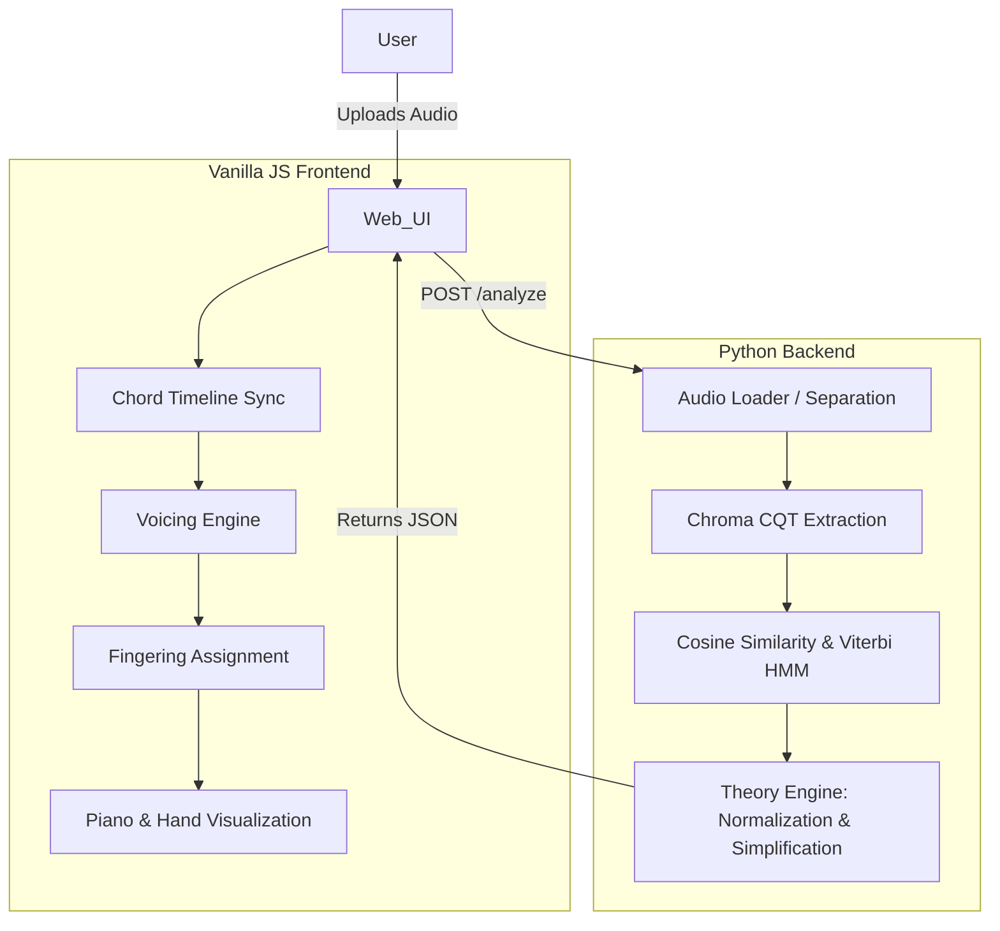
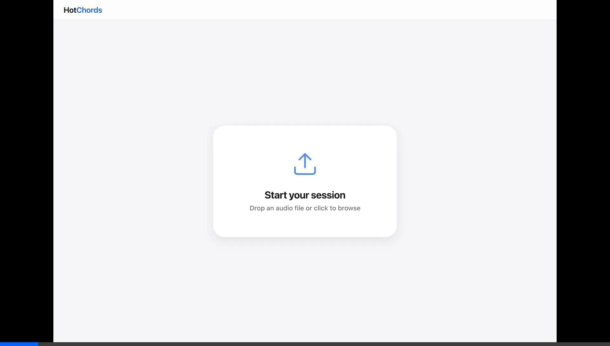
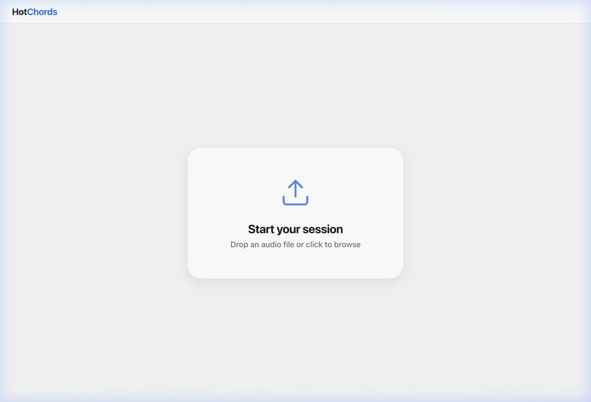

# HotChords

"Turn any song into something a beginner pianist can play."

HotChords is a free and open-source piano chord detection and learning application designed for beginners who want to play their favorite songs but struggle with complicated chords and piano voicings. 

The application analyzes songs and translates detected musical information into a piano-focused learning experience. The long-term goal is to make songs easier for beginners to play by creating simpler, practical arrangements.

## Why HotChords?

Learning a song on piano is often not difficult because the song itself is impossible. It is difficult because the original chord arrangement may be too complicated for a beginner. 

HotChords is designed to bridge the gap between **SONG** and **BEGINNER-PLAYABLE PIANO ARRANGEMENT**.

The application eventually helps a user move from:
1. "I don't know what chords are being played."
2. "I know the chords."
3. "I know which keys to press."
4. "I know which fingers to use."
5. "I can actually play the song."

## What Problem Are We Solving?

A beginner pianist may want to play a song but struggle because the original song contains complicated chords, inversions, difficult voicings, or frequent chord changes.

Existing chord detection tools can tell the user: *"What chord is this?"*

HotChords wants to go further and answer: *"How can a beginner actually play this song?"*

The product philosophy is:
**DETECT THE CHORD. SIMPLIFY THE CHORD. SHOW THE USER HOW TO PLAY IT.**

## How HotChords Works

1. **Upload** a song locally.
2. HotChords **analyzes** the audio (extracting chroma features, detecting beats, and tracking chords).
3. The Viterbi HMM **smoothes** detections into a musical progression.
4. The theory engine **simplifies** and normalizes the chords.
5. The UI displays **synchronized piano voicings** and fingering instructions as the song plays.

## Current Features

**AUDIO / ANALYSIS**
- Local song upload (processes entirely on your machine)
- Audio processing & waveform visualization
- Song playback & seeking
- BPM & key detection
- Harmonic separation (HPSS)
- Beat-synced chord progression analysis

**CHORD SYSTEM**
- Musician-friendly chord naming (enharmonic normalization)
- Chord progression visualization with Roman numerals
- Beginner-oriented chord representation (basic triad collapsing)

**PIANO**
- Responsive 61-key piano keyboard (SVG)
- Chord note highlighting
- One playable voicing per hand (rather than highlighting every octave)
- Dedicated left-hand (bass) and right-hand (harmony) notes
- Note labels on keys

**FINGERING / LEARNING**
- Left and right hand fingering assignments
- 5-color visual relationship between fingers and keys
- Animated hand visualization showing finger placement

**UI**
- Apple-inspired, responsive full-screen visual design
- Interactive waveform and playback controls
- Current chord and upcoming progression display

## Piano Learning Experience

HotChords is intentionally piano-first. 

The application connects: **CHORD → NOTES → HAND → FINGERS → PIANO KEYS**.

This means the user should not need to understand music theory deeply before being able to play. We focus on:
- Practical voicings (Octave 2 for left hand, Octave 4 for right hand)
- Clear left/right hand separation
- Pedagogical finger numbering
- Visual piano guidance with synchronized chord changes

## Product Vision

HotChords is an open-source project working towards a long-term dream:

UPLOAD A SONG 
↓ 
DETECT THE CHORDS 
↓ 
UNDERSTAND MUSICAL CONTEXT 
↓ 
SIMPLIFY COMPLEX CHORDS 
↓ 
CREATE A BEGINNER-FRIENDLY ARRANGEMENT 
↓ 
**CREATE A 4-CHORD VERSION WHERE MUSICALLY APPROPRIATE** 
↓ 
SHOW THE USER HOW TO PLAY IT 
↓ 
SYNCHRONIZE WITH THE SONG

*Note: HotChords does not currently force every song into 4 chords. This is a long-term goal to find the simplest practical representation that still allows a beginner to recognize and play the song without destroying its musical identity.*

## Technology

HotChords is built on a lightweight, dependency-conscious stack:

- **Python (3.9+)**: Backend processing and application entry point.
- **FastAPI / Uvicorn**: High-performance asynchronous API for local serving.
- **Librosa / NumPy / SciPy**: Core DSP, harmonic separation, and feature extraction.
- **PyTorch / Demucs (Optional)**: Deep-learning based stem separation to isolate instruments.
- **Vanilla JavaScript, HTML, CSS**: Zero-build-step frontend for maximum portability.
- **GSAP 3**: Smooth, high-performance UI animations for hand diagrams.
- **Web Audio API**: Browser-based playback, pitch-shifting (detuning), and waveform rendering.

## Architecture



## Screenshots

| App Open | Home Interface |
|:---:|:---:|
|  |  |

## Installation

### Prerequisites
- Python 3.9+
- `ffmpeg` (required for MP3/M4A processing)

```bash
# macOS
brew install ffmpeg

# Ubuntu / Debian
sudo apt install ffmpeg
```

### Setup

```bash
git clone https://github.com/hotfix/hotchords.git
cd hotchords

python3 -m venv venv
source venv/bin/activate

# Install dependencies
pip install -r requirements.txt
```

*(Optional): If you do not want to install PyTorch/Demucs for AI stem separation, install the lightweight requirements instead:*
`pip install librosa fastapi uvicorn pydantic python-multipart numpy scipy`

## Running Locally

To start the application:

```bash
python3 hotchords.py
```

The browser will automatically open to `http://localhost:5500`.

## Project Structure

```
HotChords App/
├── hotchords.py              # Application entry point
├── backend/                  # Python DSP & Theory engines
│   ├── main.py               # Uvicorn server configuration
│   ├── api/                  # FastAPI routes
│   ├── analysis/             # Core audio pipeline (HPSS, CQT, Viterbi)
│   ├── theory/               # Music theory, simplification, enharmonics
│   └── utils/                # State management
├── frontend/                 # Static web assets (Vanilla JS)
│   ├── index.html            # Main UI shell
│   ├── css/piano.css         # Apple-inspired design system
│   └── js/
│       ├── engine/           # Voicing and naming logic
│       ├── ui/               # SVG generation for piano and hands
│       └── animations/       # GSAP controllers
├── docs/                     # Extended documentation (Pipeline, Fingering)
└── scripts/, tests/, .github/ # Dev tools
```

## Accuracy Philosophy

Chord detection accuracy is one of our most important technical goals. 

We do not claim that HotChords is currently the "most accurate" chord detector in the world. Instead, we are actively researching and improving:
- Harmonic separation and Chroma representations
- Overtone-aware chord templates
- Temporal smoothing and Viterbi decoding
- Chord transition modeling

*Current implementation details can be found in [docs/AUDIO_PIPELINE.md](docs/AUDIO_PIPELINE.md).*

## Privacy

**HotChords is a 100% local application.**
- All audio processing happens on your machine.
- Audio files are never uploaded to the cloud.
- No external APIs are used for analysis.
- No telemetry or tracking is embedded.
- Temporary audio stems are written to your local system's temp folder and cleaned up automatically.

## Current Limitations

- **Complex Arrangements:** Dense electronic or heavily layered tracks may confuse the current chroma-based detector.
- **Rhythm Extraction:** Chord boundaries are quantized to detected beats; heavily syncopated tracks may show slight visual misalignment.

## Roadmap

**CURRENT**
- Local audio upload and Viterbi-smoothed chord detection.
- SVG 61-key piano rendering and pedagogical fingering assignment.
- Real-time Web Audio API playback with GSAP UI sync.

**IN DEVELOPMENT**
- Improving Demucs AI stem separation integration.
- Enhancing the chord transition matrix for jazz/complex harmonies.

**FUTURE (Long-term goals)**
- Intelligent chord simplification (Beginner-friendly 4-chord arrangements).
- Better piano voicing selection and voice-leading.
- Cross-platform desktop packaging (Tauri).
- Benchmarking against MIR datasets (e.g., McGill Billboard).

## Contributing

HotChords is a serious open-source project under active development. 

We invite contributions from Developers, DSP engineers, MIR researchers, Musicians, Piano teachers, and UX designers to help build the future of beginner-friendly music learning.

Please read our [CONTRIBUTING.md](CONTRIBUTING.md) to understand our "Accuracy over features" philosophy and local setup instructions.

## License

This project is licensed under the MIT License - see the [LICENSE](LICENSE) file for details.
