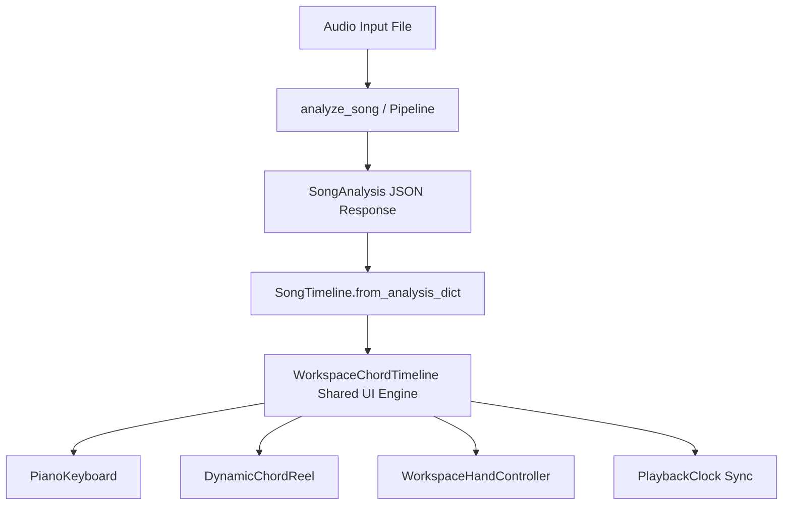

# HotChords Song Result & Timeline API Contract

**Date**: September 2026  
**Contract Version**: `0.4.0`  

---

## 1. Single Authoritative Source of Truth

HotChords enforces a single unified data contract between the Python MIR analysis pipeline, the local REST server, and the frontend desktop application.



---

## 2. Canonical JSON Result Contract Schema

```json
{
  "ready": true,
  "duration": 213.60,
  "key": "E",
  "scale": "Major",
  "key_full": "E Major",
  "tempo": 99.4,
  "time_sig": "4/4",
  "scale_notes": [4, 6, 8, 9, 11, 1, 3],
  "status": "SUCCESS",
  "status_message": "Clean harmonic structure",
  "chord_source": "other",
  "source_agreement": 0.643,
  "chords": [
    {
      "time": 0.0,
      "end": 2.41,
      "chord": "C#m7",
      "raw_chord": "C#:min7",
      "root": "C#",
      "quality": "min7",
      "bass": null,
      "simplified_chord": "C#m",
      "confidence": 0.902,
      "difficulty_score": 0.650,
      "source_evidence": "other",
      "voicing": {
        "leftHand": [
          {"midi": 37, "note": "C#2", "finger": 5, "color": "#1677FF"}
        ],
        "rightHand": [
          {"midi": 61, "note": "C#4", "finger": 1, "color": "#FF4D4F"},
          {"midi": 64, "note": "E4", "finger": 2, "color": "#FAAD14"},
          {"midi": 68, "note": "G#4", "finger": 3, "color": "#52C41A"},
          {"midi": 71, "note": "B4", "finger": 5, "color": "#1677FF"}
        ],
        "midiNotes": [37, 61, 64, 68, 71],
        "difficultyScore": 0.650
      }
    }
  ],
  "beginner_chords": [
    {
      "time": 0.0,
      "end": 2.41,
      "chord": "C#m",
      "raw_chord": "C#:min7",
      "root": "C#",
      "quality": "min",
      "bass": null,
      "simplified_chord": "C#m",
      "confidence": 0.902,
      "difficulty_score": 0.650,
      "source_evidence": "other",
      "voicing": {
        "leftHand": [
          {"midi": 37, "note": "C#2", "finger": 5, "color": "#1677FF"}
        ],
        "rightHand": [
          {"midi": 61, "note": "C#4", "finger": 1, "color": "#FF4D4F"},
          {"midi": 64, "note": "E4", "finger": 3, "color": "#52C41A"},
          {"midi": 68, "note": "G#4", "finger": 5, "color": "#1677FF"}
        ]
      }
    }
  ],
  "four_chord_loop": {
    "available": true,
    "chords": ["C#m7", "Abm", "A", "B"],
    "rawChords": ["C#:min7", "Ab:min", "A:maj", "B:maj"],
    "simplifiedChords": ["C#m", "Abm", "A", "B"],
    "section": "REPEATING_SECTION_A",
    "start": 0.0,
    "end": 9.683,
    "duration": 9.683,
    "confidence": 0.902,
    "occurrences": [0.0, 38.48, 153.67],
    "repetitionCount": 3,
    "playabilityScore": 0.650,
    "voicings": [
      {
        "leftHand": [{"midi": 37, "note": "C#2", "finger": 5, "color": "#1677FF"}],
        "rightHand": [
          {"midi": 61, "note": "C#4", "finger": 1, "color": "#FF4D4F"},
          {"midi": 64, "note": "E4", "finger": 3, "color": "#52C41A"},
          {"midi": 68, "note": "G#4", "finger": 5, "color": "#1677FF"}
        ]
      }
    ]
  },
  "structure": {
    "sections": [
      {"label": "REPEATING_SECTION_A", "start": 0.0, "end": 9.079, "duration": 9.079}
    ],
    "structureConfidence": 0.88,
    "hasRepeatingPatterns": true
  }
}
```

---

## 3. Explicit Safety & Negative States

If the audio lacks harmonic structure, the API guarantees deterministic non-hallucinating responses:

| Audio Condition | `status` Field | `four_chord_loop.available` | `chords` Payload | Behavior |
|---|---|---|---|---|
| **Clean Music** | `SUCCESS` | `true` or `false` | Full chord timeline | Normal playback |
| **Weak / Noisy Audio** | `LOW_CONFIDENCE` | `true` or `false` | Low confidence tags | Display heuristic reliability |
| **Speech / Monophonic Rap** | `SUCCESS` / `LOW_CONFIDENCE` | `false` | Single tonal center ($Gm$) | Timeline available, loop disabled |
| **Silence / Noise / Drums Only** | `EMPTY_AUDIO` / `NO_HARMONIC_CONTENT` | `false` | `[]` (Empty) | Rejects fake progressions |
