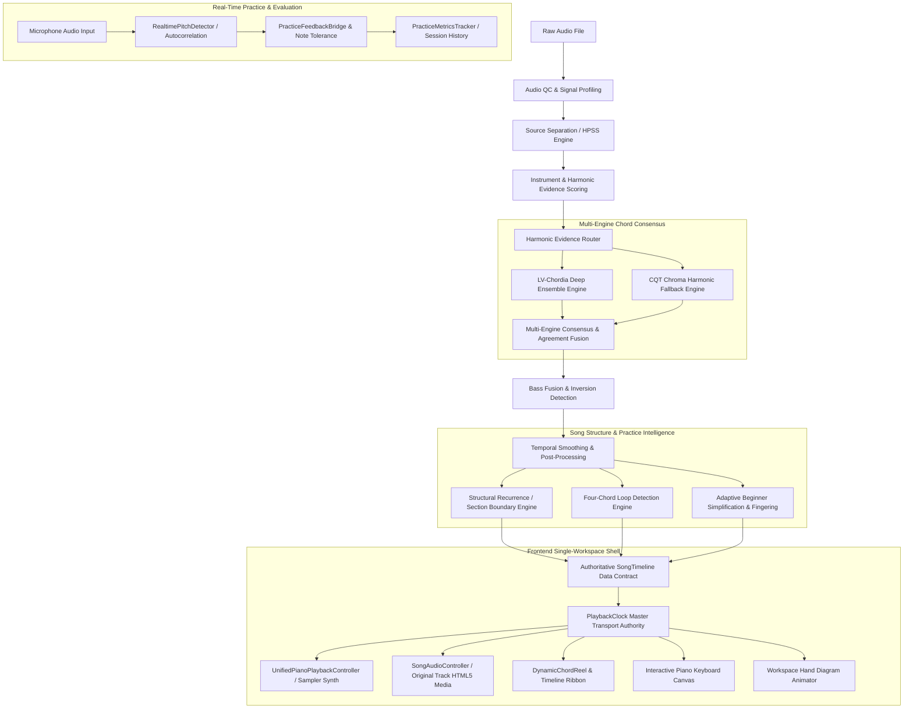

# HotChords System Architecture (v0.4.0)

HotChords is a local-first, interactive desktop audio workstation that transforms raw audio recordings into structured, playable piano arrangements with synchronized chord charts, keyboard voicings, and realtime practice feedback.

---

## 1. High-Level System Architecture

---

## 2. Backend Analysis Pipeline (`backend/analysis/`)

### 2.1 Audio QC & Objective Profiling (`backend/analysis/profiling.py`)
Before chord recognition begins, the input signal undergoes objective acoustic quality profiling:
- **Signal-to-Noise Ratio (SNR):** Estimated across active vs. quiet frames.
- **Dynamic Range & Crest Factor:** Measures peak-to-RMS ratios to detect compressed or distorted tracks.
- **Clipping Ratio & Silence Detection:** Flags heavily clipped files ($>0.05\%$ samples at peak) or unanalyzable silence.
- **Spectral Centroid & Rolloff:** Profiles harmonic distribution to determine acoustic vs. synthesized content.

### 2.2 Source Separation & Harmonic Routing (`backend/analysis/harmonic_evidence.py`, `source_separation.py`)
- **Demucs Hybrid Transformer (`htdemucs`):** When available, decomposes the mix into `drums`, `bass`, `other` (harmonic carrier), and `vocals`.
- **Harmonic-Percussive Source Separation (HPSS):** Applies median-filter mask separation ($margin=4$) to isolate tonal content from transient percussion.
- **Instrument Evidence Scoring (`instrument_evidence.py`):** Calculates spectral flatness, harmonic energy, and chroma clarity across stems to rank candidate sources (`piano`, `guitar`, `other`, `mix`). Non-harmonic stems (`drums`, `vocals`) are strictly excluded from chord detection.

### 2.3 Multi-Engine Chord Consensus (`backend/analysis/engine_manager.py`)
HotChords uses an ensemble consensus architecture:
1. **Large-Vocabulary Deep Engine (`lv_chordia_engine.py`):** Neural ensemble transcription model detecting triads, 7ths, inversions, and extended harmony.
2. **CQT Chroma Correlation Fallback (`legacy_engine.py`):** Constant-Q transform with overtone-aware template matching (36 bins/octave) for robust fallback.
3. **Source Agreement & Bass Fusion (`source_agreement.py`):** Combines detected root/bass notes from the isolated bass register with upper-structure harmony to detect slash chords (e.g., $C/E$, $G/B$) and computes cross-stem agreement percentages.

### 2.4 Reliability & Confidence Scoring (`backend/analysis/confidence.py`)
HotChords computes an honest, mathematical confidence metric ($0.0 \dots 1.0$) rather than synthetic accuracy claims:
$$\text{Reliability} = 0.40 \cdot \text{HarmonicStrength} + 0.35 \cdot \text{TemporalStability} + 0.25 \cdot \text{BeatAlignment}$$
- **Harmonic Strength:** Average template cosine fit or classifier softmax margin.
- **Temporal Stability:** Penalty for rapid, unnatural harmonic oscillations.
- **Beat Alignment:** Agreement with estimated downbeat and subdivision boundaries.

### 2.5 Structural Analysis & Four-Chord Loop Detection (`backend/analysis/structure.py`, `loop_detection.py`)
- **Self-Similarity Recurrence Matrices (SSM):** Computes cosine similarity between chroma vectors over time to identify macro sections without hallucinating artificial genre labels.
- **Four-Chord Loop Detection:** Evaluates sliding 4-chord windows across modulo-12 transposition deltas, rejecting non-progressions (e.g., $C|C|C|C$) and isolating repeated chord cycles (e.g., $F\sharp \rightarrow B\flat7 \rightarrow E\flat m \rightarrow B$) with exact timestamps.

---

## 3. Music Theory & Arrangement Engine (`backend/theory/`)

- **Standardized Chord Normalization (`normalization.py`):** Normalizes MIR notation into canonical roots and qualities (Major, Minor, 7th, Maj7, Min7, Dim, Aug, Sus4).
- **Adaptive Beginner Simplification (`simplification.py`):** Converts complex jazz/extended chords into playable root-position and standard triad shapes while preserving harmonic fidelity.
- **Piano Voicing & Dynamic Fingering (`piano_voicing.py`):** Generates voice-led, ergonomic piano voicings for Left Hand (bass root/5th) and Right Hand (triad/inversion) with biomechanical finger assignment ($1 \dots 5$).

---

## 4. Single-Workspace Desktop Frontend (`frontend/`)

HotChords operates as a permanent single-workspace application built with zero external framework overhead (pure Vanilla ES6+ and CSS):

### 4.1 Master Clock Authority (`frontend/js/audio/playbackClock.js`)
All UI components, animations, and audio renderers subscribe to a single canonical `PlaybackClock`:
- **State Machine:** `STOPPED`, `PLAYING`, `PAUSED`.
- **Looping Semantics:** Seamless hardware-timed boundary wrapping (`seek(loop.start)`) when reaching `loop.end`.
- **Zero-Drift Synchronization:** Emits requestAnimationFrame (rAF) snapshots consumed by UI components without DOM churn.

### 4.2 Dual-Source Audio Architecture
1. **Polyphonic Piano Synthesizer (`UnifiedPianoPlaybackController.js`, `PianoPlaybackService.js`):**
   - Sample-accurate Salamander Grand Piano audio playback.
   - Intelligent voice allocation, pitch transposition, and sustain pedal management.
2. **Original Track Media Controller (`SongAudioController.js`):**
   - Streams local user audio via HTML5 `<audio>` with hardware pitch preservation (`preservesPitch = true`).
   - Mutual exclusivity: Switching between Piano Synth and Original Track cleanly mutes/pauses the inactive source without interrupting the master timeline.

### 4.3 Visual Components
- **`DynamicChordReel.js`:** 3-chord perspective reel showing previous, active, and upcoming chords with smooth CSS transforms.
- **`PianoKeyboard.js`:** 88-key responsive SVG/Canvas keyboard highlighting active notes with hand-coded color tokens (Left Hand: Blue/Cyan, Right Hand: Amber/Gold).
- **`HandDiagrams.js` & `WorkspaceHandController.js`:** Anatomical hand diagram rendering real-time finger placement and chord fingering numbers.

---

## 5. Real-Time Pitch & Practice Feedback (`frontend/js/audio/`)

- **`RealtimeInputService.js`:** Captures low-latency microphone audio through Web Audio API.
- **`RealtimePitchDetector.js`:** High-speed normalized autocorrelation (YIN-variant) with dynamic octave tolerance.
- **`PracticeFeedbackBridge.js`:** Matches detected user notes against active chord voicings with configurable timing tolerance ($150\text{ms}$ window).
- **`PracticeMetricsTracker.js`:** Tracks chord transition latencies, note hit rates, and cumulative session accuracy.

---

## 6. Testing & Quality Assurance Architecture

HotChords maintains comprehensive multi-tier test suites:
- **Python Unit & Integration (`pytest tests/`):** 195 automated tests validating signal processing, source separation, chord normalization, structure analysis, and practice engines.
- **Client & Playback Lifecycle (`node tests/test_playback_lifecycle.js`):** Validates clock state transitions, seek reconciliation, and mutual audio renderer exclusivity.
- **UI/UX Architecture (`npm test`):** 37 tests verifying DOM hierarchy, single-workspace rules, and styling invariants.
- **Client Practice & Calibration (`node tests/test_phase11_client_pitch_and_feedback.js`, `test_phase12_client_metrics.js`):** Validates real-time feedback loops and calibration math.

